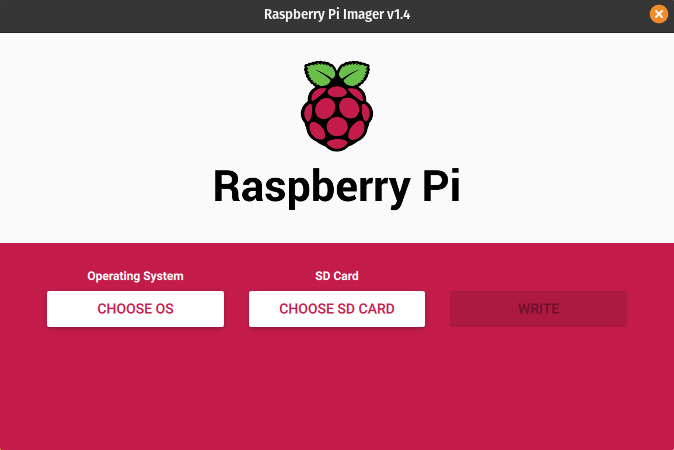
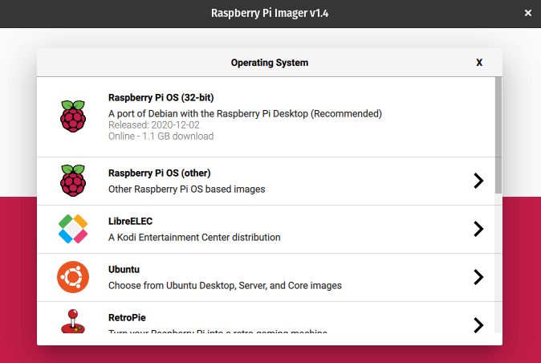
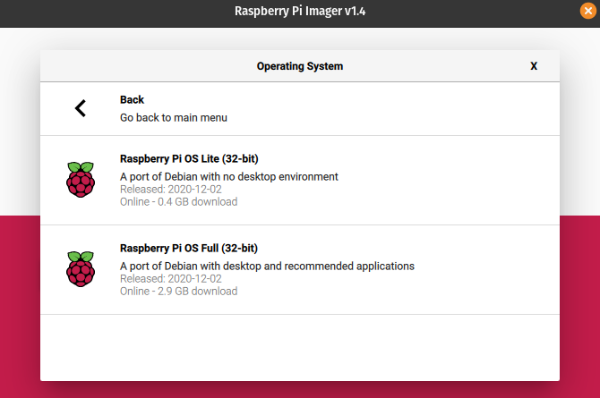
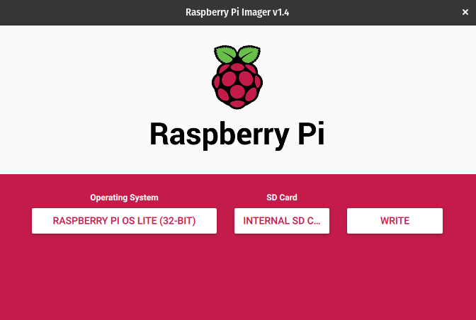
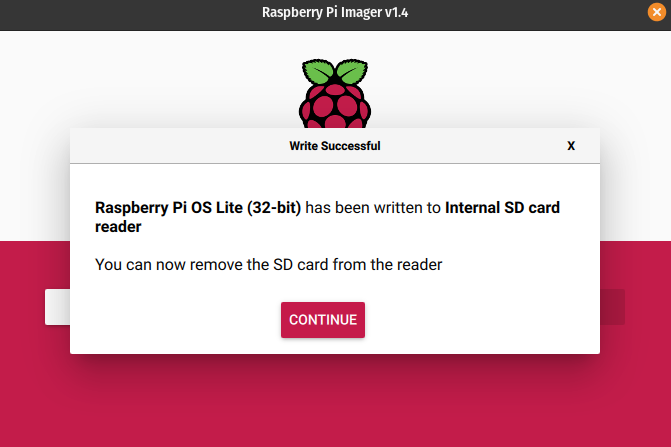

- prerequisites
- describe Installation
- describe running


# Introduction

- what is Swarm Bee client
- why would you run a Swarm Bee client, esp. on Raspi Zero W

# Prerequisites
- micro SD card with Raspbian OS, with as much free space you want to dedicate to serving files (e.g. a 32 GB card)
- RaspberryPie Zero W (the currently newest Raspi Zero, that has Wifi)
- micro USB power supply
- Raspi Housing (optional)
- micro USB to USB adapter & USB keyboard (or some other setup to connect a keyboad)
- HDMI (female) to mini HDMI (male) adapter; assuming HDMI connection to monitor
- Wifi connection to the Internet

# Installation

Probably the most elegant way to get an OS to the micro SD card to run the Pi from, is to use an app called "Raspberry Pi Imager", that is available for Linux (possibly other OSes, for the purposes of this article, Pop-OS was used).
Run it.




Choose the OS - no desktop is needed, a Lite version will do.





therefore, go for "other".




And pick the Pi OS Lite (32-bit).



Choose your SD card. Select "Write".

After the process finishes successfully, you should have a bootable micro SD card for your Raspi.




You can now put the SD card into your Raspi, and stick the whole thing into its housing, if you have one. 

Attach the USB-to-microusb to the micro USB port labeled with an USB icon (you will use it to plug in an USB keyboard).

Attach the HDMI-to-miniHDMI adapter to the mini HDMI port - you will use it to plug in you HDMI monitor.

Now attach your peripherals and the power supply (the micro USB port with the power icon). Your raspi should boot up, visible on the monitor. Some housekeeping takes place at first boot, so it might take a bit longer.


Login as user "pi", password "raspberry" (these are the default setting, you will of course change them later on, although out of scope of this article).

Run `sudo raspi-config`

System options -> Wireless LAN -> answer questions to set up access to Wifi (should have Internet access , of course)

System options -> Password -> change to a more secure one

Interface options -> SSH -> enable

When asked to reboot, do so.

You can now work directly on the machine, or SSH to it from another one.

Run `sudo apt update` , followed by `sudo apt upgrade` to get the latest updates. 

Next, install git via `sudo apt install git`

Download and install golang 1.15 as described on the golang page https://golang.org/doc/install#install. Basically, you will need to find the build appropriate for Raspi Zero W, which can be found here: https://golang.org/dl/

To download it run `wget https://golang.org/dl/go1.15.6.linux-armv6l.tar.gz`

Extract as `sudo tar -C /usr/local -xzf go1.15.6.linux-armv6l.tar.gz`

Edit your .profile, eg. `nano ~/.profile`

add `export PATH=$PATH:/usr/local/go/bin`at the end of it

CTRL-O, CTRL-X to save and exit

run `source $HOME/.profile`

run `go version` to check go is working


Now you can install Swarm Bee client. Since a built binary does not exist for Raspie Zero W, you will have biuld it yourself from source. Therefore, the appropriate instructions are here: https://docs.ethswarm.org/docs/installation/build-from-source

```
git clone https://github.com/ethersphere/bee

cd bee

git checkout v0.4.1

make binary
```

The build will probably take some time, grab a lunch.

After it finishes, check that Bee exists.

``` 
./dist/bee version
```

It should print out a version number with a some other string at the end. E.g. `0.4.1-4b98b68`


Make a link to bee executable from a folder that is in $PATH, to make it run from any "folder"

```
cd /usr/local/bin/
sudo ln -s /home/pi/bee/dist/bee
```


Configuring bee

We will set it up to be run manually, by starting a bee executable and using a custom config file. 

Generate a default bee config file, from the user's home folder (/home/pi) running:

`bee printconfig --verbosity=5 &> .bee.yaml`

Edit it

`nano .bee.yaml`

Set / change the following lines:


```
debug-api-enable=true # optional - makes debug API available
password: "somethingsecure" # optional - uses this password instead of asking every time
swap-endpoint: https://rpc.slock.it/goerli 
```

Save with CTRL-O, CTRL-X.

Now you should be able to run bee by running `bee start`. Although it will start, you will get messages of it needing to have goerli eth and goerli bzz available (at the time of writing it runs on Goerli testnet and these are needed for the incentives contracts to initiate and work). The messages will instruct you where to go to to reach a faucet that will give you the funds needed to start., e.g. https://faucet.ethswarm.org?address=yourethereumaddress

Open it in your browser and confirm you are not a robot. click to "Request goeth and gbzz".

You should get a success message. Wait for a minute, then check back you node. 

Some initial chequebook deployments will be made and syncing with the network should start. 

Now you should be able to start it any time with `bee start`

You can install a JSON parser `sudo apt install jq`

And run `curl http://localhost:1635/topology | jq ` (on another terminal) to see how many nodes are connected

Exit running the client with CTRL-C.


